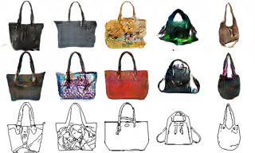
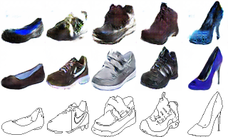
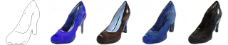
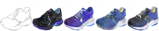

# NAM: Non-Adversarial Mapping

This repo contains PyTorch code replicating the main ideas presented in:

- **NAM - Unsupervised Cross-Domain Image Mapping without Cycles or GANs**<br/>
*Yedid Hoshen and Lior Wolf, ICLR 2018 Workshop*<br/>
[ICLR Manuscript](https://openreview.net/pdf?id=BJPlJVywz)

- **Non-Adversarial Unsupervised Domain Mapping**<br/>
*Yedid Hoshen and Lior Wolf, ECCV 2018*<br/>
[https://arxiv.org/abs/1806.00804](https://arxiv.org/abs/1806.00804)

## Examples

### Edges2Bags
<br/>
Top: DiscoGAN Middle: NAM: Bottom: Source
### Edges2Shoes
<br/>
Top: DiscoGAN Middle: NAM: Bottom: Source
### Variation in Outputs:
<br/>
<br/>


## Getting Started

1) Download Edges2Shoes data:
```
cd data
sh get_data.py
cd ..
```

2) Train DCGAN unconditional generative model for the A domain:
```
cd code
python train_gen.py
```

3) Use NAM to train a mapping from A to B:
```
python train_nam.py
```

4) Evaluate multiple image analogies:
```
python eval_variation.py $image_id 
```
Where *$image_id* is replaced with the ID of the image you wish to map.

Note: DCGAN training can diverge sometimes. Unconditional samples from each epoch are available in "code/unconditional_ims/". If DCGAN training diverged, simply re-run it.

## License
This project is CC-BY-NC-licensed.
